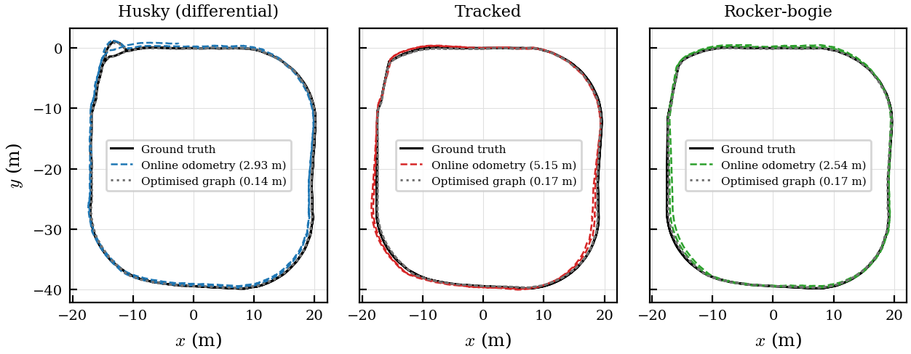
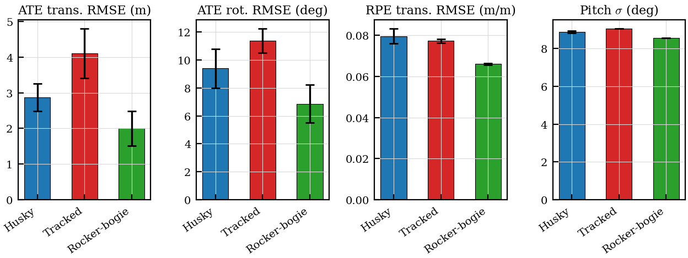
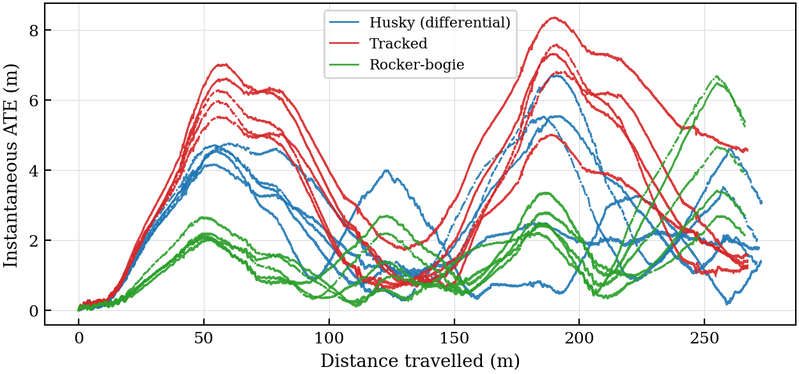
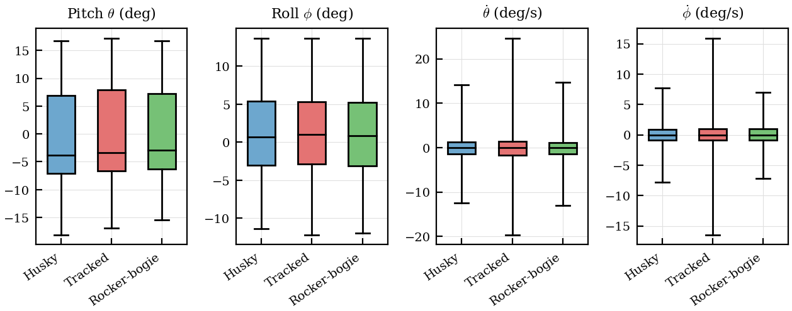
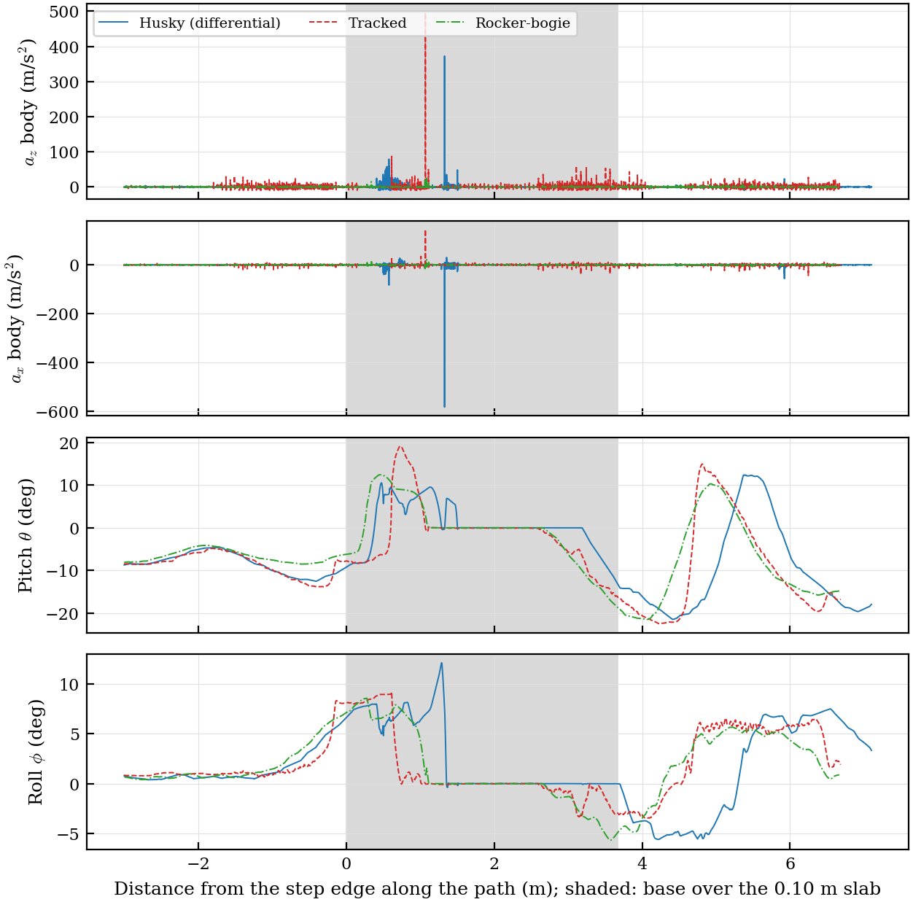

# Comparative Study: Rocker-Bogie vs. Differential vs. Tracked Robots in Underground Mine Environments

Comparative analysis of three robotic locomotion platforms evaluating mechanical stability and SLAM performance during autonomous navigation in a simulated underground mine tunnel network.

## Overview

This project implements a complete simulation and evaluation pipeline to compare:

| Platform | Description |
|----------|-------------|
| **Rocker-Bogie** | 6-wheel passive suspension mechanism |
| **Differential Drive** | Husky A200 equivalent, 4-wheel skid-steer |
| **Tracked** | Continuous track system |

Each robot traverses the same **137.7 m, 17-waypoint closed loop** (`mine_loop_2026`)
through an underground mine environment while collecting IMU, odometry, and SLAM
data for post-run comparative analysis.

The route is defined **once**, in Gazebo world coordinates, in
`robot_metrics/config/route_mine.yaml`. `generate_waypoints.py` projects it into
each robot's own map frame using that platform's spawn pose from
`sim_config.yaml`, producing the per-robot `config/waypoints_mine.yaml` files.
Those are **generated artefacts — do not edit them by hand**: doing so puts one
platform on a different route from the other two and invalidates the comparison.

### Key Findings

Campaign of 2026-09-17/18, at commit `4cacede`: fixed-trajectory control with
the swept LiDAR, 5 runs per platform, two laps of the closed loop (~267 m of
ground truth per run). Figures, tables and per-run trajectories are in
[`results/`](results/).

| Mean ± std, n=5 | Husky (differential) | Tracked | Rocker-bogie |
|---|---|---|---|
| ATE translational RMSE (online) [m] | 2.874 ± 0.385 | 4.107 ± 0.695 | **2.005 ± 0.486** |
| ATE optimised graph RMSE [m] | 0.141 ± 0.007 | 0.170 ± 0.007 | 0.166 ± 0.002 |
| RPE translational RMSE [m/m] | 0.0796 ± 0.0037 | 0.0772 ± 0.0009 | **0.0660 ± 0.0004** |
| Vibration RMS [m/s²] | 2.057 ± 0.189 | 4.362 ± 0.060 | **0.767 ± 0.022** |
| Peak abs(a_z − g) [m/s²] | 54.9 ± 6.2 | 78.1 ± 12.0 | **15.5 ± 9.6** |
| Pitch max abs [deg] | 33.6 ± 0.6 | 35.6 ± 0.8 | **30.1 ± 0.1** |

Three things to read off it, in the order they matter:

- **The spread lives in the odometry, not in the map.** The three optimised
  graphs land within 3 cm of each other while the online estimates differ by a
  factor of two. What this comparison measures is the pose the robot navigated
  on, not the map it ends up with.
- **The rocker-bogie is the quiet platform.** Its vibration RMS is 2.7× below
  the Husky's and 5.7× below the tracked robot's, and it carries the lowest
  online ATE and the lowest RPE.
- **No loop closure fired in any of the 15 runs.** The events are proximity
  detections only, with 0 false positives. The zeros in the loop-closure rows
  are a fact of this campaign, not a missing measurement.

## Project Structure

```
journal_comparison/
├── src/
│   ├── rocker_bogie/           # 6-wheel rocker-bogie robot package
│   │   ├── urdf/               # URDF/XACRO robot model
│   │   ├── launch/             # Gazebo, SLAM, navigation launch files
│   │   ├── scripts/            # Control and odometry scripts
│   │   ├── config/             # Navigation and controller parameters
│   │   ├── meshes/             # STL 3D meshes
│   │   └── world/              # Gazebo mine environment
│   ├── differential/           # Husky A200 equivalent package
│   │   ├── launch/
│   │   ├── scripts/
│   │   ├── urdf_xacro/
│   │   └── config/
│   ├── tracked/                # Tracked vehicle package
│   │   ├── gazebo_continuous_track/
│   │   └── gazebo_continuous_track_example/
│   └── robot_metrics/          # Metrics logging and analysis
│       ├── config/             # route_mine.yaml, sim_config.yaml
│       ├── scripts/
│       │   ├── run_campaign.sh          # campaign driver: the entry point
│       │   ├── check_sim_parity.py      # refuses a campaign if the three drift apart
│       │   ├── generate_waypoints.py    # projects the shared route per platform
│       │   ├── metrics_logger.py        # the per-run log (metrics.csv, the .tum files)
│       │   ├── trajectory_follower.py   # ground-truth pursuit (--fixed-trajectory)
│       │   ├── sweep_distortion.py      # swept-LiDAR distortion (--lidar swept)
│       │   ├── imu_ahrs.py              # orientation the IMU plugin does not publish
│       │   ├── aggregate_runs.py        # tables over the repetitions
│       │   ├── analyze_metrics.py       # per-run figures
│       │   ├── plot_*.py                # the Results-section figures
│       │   └── scale_masses.py          # mass normalization across platforms
│       └── test/               # offline benches: no ROS, no Gazebo, just asserts
└── results/                    # published campaign: figures, tables, trajectories
```

The benches under `robot_metrics/test/` run standalone (`python3 test_*.py`) and
are how the non-obvious pieces are checked without a simulation: the swept-LiDAR
distortion against an analytic ground truth, the `bogie_drop` compensation that
would otherwise sink half the suspension silently, the alignment trigger of the
follower, and the suspension column list that has to agree in three files at
once.

The vineyard experiment lives in a separate workspace, `~/journal_vineyard_comparison`.

### Which file Gazebo actually loads

Not the same for the three platforms, and getting it wrong is expensive:

| Platform | Spawned from | `robot_description` |
|----------|--------------|---------------------|
| Rocker-Bogie | `urdf/ensamblajeurdf.xacro` | same file |
| Differential | `model/differential/model.sdf` | `urdf_xacro/husky_gazebo.urdf.xacro` |
| Tracked | `model/two_track_robot/model.sdf` | `urdf_xacro/two_track_robot_gazebo.urdf.xacro` |

The two SDF-spawned platforms still load their xacro into `robot_description`,
because `gazebo_ros_control` reads the joint effort limits from there. **Both
files have to be kept in step**, and `scale_masses.py` edits the xacro, not the
SDF. `check_sim_parity.py` section 9 weighs whichever file is actually spawned,
precisely so this cannot drift unnoticed.

The tracked platform **must** be spawned from its SDF. It was briefly switched
to `spawn_model -urdf` from the xacro so that one definition would be
authoritative; the intent was right, but sdformat's URDF-to-SDF conversion
cannot express what `gazebo_continuous_track` needs and silently dropped three
things: the `<robotNamespace>` (which froze the whole simulation), the
`left_body` / `right_body` links (lumped away as fixed joints), and the
`<pose relative_to=...>` on every belt segment — which put **both tracks on the
chassis centreline**. `model/two_track_robot/` is therefore versioned, via an
exception in that package's `.gitignore`, which ignores `model/` because
upstream generates it.

## Technologies

- **ROS Noetic** — Robot Operating System framework
- **Gazebo 11** — 3D physics simulation
- **RTAB-Map** — Real-Time Appearance-Based SLAM
- **URDF/Xacro** — Robot modeling
- **move_base** — Autonomous navigation stack (DWA local planner + navfn global planner)
- **Python 3** — Control scripts, data analysis (pandas, numpy, matplotlib, scipy)

### Simulated Sensors

Identical across the three platforms — `check_sim_parity.py` enforces this, and
`extract_sensor_poses.py --standardize` reports the mounting poses.

| Sensor | Specs |
|--------|-------|
| Velodyne VLP-16 LiDAR | 16 channels, 1875 samples/scan, 360° FOV, 10 Hz, 100 m range |
| IMU (6-axis) | 100 Hz, angular velocity + linear acceleration |
| RGB Camera | 640×480 px, 30 Hz |
| Wheel/track contact sensors | 100 Hz (2× the 50 Hz logging rate) |

The LiDAR range was 130 m until 2026-08-23. That figure was not a Velodyne
number: it is the default of `velodyne_simulator`, from which this project
inherited the plugin and the sampling pattern. The VLP-16 datasheet says 100 m.
The `<ray>` block is deliberately set one metre wider than the plugin's
`max_range`, and its `<min>` (0.3 m) is deliberately below the plugin's
`min_range` (0.9 m) — that is the reference design, not an inconsistency: the
0.9 m cutoff reproduces the near-field behaviour of the real
`velodyne_pointcloud` driver.

**IMU covariances.** `gazebo_ros_imu_sensor` fills the covariance diagonals from
its own `<gaussianNoise>` parameter — the same parameter that injects the noise.
This project needs every random draw to come from the seeded generator (the
`<noise>` blocks of the `<sensor>`, which `gzserver --seed` controls), so the
plugin's `gaussianNoise` is 0.0 and the covariances came out zero, i.e.
"unknown" per the `sensor_msgs/Imu` spec. `imu_covariance.py` closes the gap:
the plugin publishes raw on `/imu/data_raw` and that node republishes
`/imu/data` with the diagonals filled from the declared standard deviations.
The orientation variance is a modelling choice, not a measurement — Gazebo's
orientation is noiseless ground truth — and should be declared as such.

## Prerequisites

- **Ubuntu 20.04 LTS**
- **ROS Noetic**
- **Gazebo 11+**
- **Python 3.8+** with `rospy`, `pandas`, `numpy`, `matplotlib`, `scipy`, `pyyaml`, `actionlib`
- ROS packages: `gazebo_ros`, `gazebo_ros_control`, `controller_manager`, `move_base`, `rtabmap_ros`, `robot_state_publisher`

### Build

```bash
cd ~/journal_comparison
catkin_init_workspace src     # only on a fresh clone: makes src/CMakeLists.txt
catkin_make
source devel/setup.bash
```

`src/CMakeLists.txt` is not in the repository: catkin creates it as a symlink
into the local ROS installation, so it is machine-specific.
`catkin_init_workspace` remakes it.

## Running

### Full campaign (what produces the paper tables)

The experiment is 3 platforms x 3 runs, driven by a script rather than by hand
so that no parameter can drift between runs. It refuses to start unless
`check_sim_parity.py` confirms the three platforms share the same world, physics
and terrain, and `generate_waypoints.py --check` confirms no waypoint file has
been hand-edited away from the shared route.

```bash
rosrun robot_metrics run_campaign.sh --dry-run      # print what would happen
rosrun robot_metrics run_campaign.sh                # all 3 robots, runs 1-3
rosrun robot_metrics run_campaign.sh --robots rocker_bogie --runs 5
rosrun robot_metrics run_campaign.sh --fixed-trajectory          # see below
rosrun robot_metrics run_campaign.sh --fixed-trajectory --laps 3
```

`--fixed-trajectory` drives all three platforms along one ground-truth path
instead of navigating, so the SLAM is recorded but cannot steer. It is a second
experiment, not a replacement, and it writes to
`<output>/fixed_trajectory/`. `--laps N` repeats the closed loop N times: it
accumulates drift over *the same* geometry and multiplies the loop-closure
opportunities without inventing new terrain.

Since 2026-08-23 the trajectory follower shuts the run down when it finishes,
rather than idling until `--duration` expires. `--duration` is therefore a
safety net, not the stop condition; raise it freely for multi-lap runs. Before
that change every completed run was still stamped `timed_out: true` and burned
the remaining wall clock.

Results land in `~/metrics_output/<robot>/runNN/`, with aggregated tables and
figures in `~/metrics_output/paper_tables/`. Gazebo's RNG seed for run *N* is
`seed_base + N`, recorded in each `run_meta.yaml`, so any single run can be
replayed exactly.

Map quality is still scored by hand after the campaign:

```bash
rosrun rtabmap_ros rtabmap-export --cloud map.pcd ~/.ros/rtabmap.db
rosrun robot_metrics map_vs_groundtruth.py --map map.pcd \
    --run ~/metrics_output/<robot>/run01 --output_dir ~/metrics_output/paper_tables
```

### A single run by hand

Three terminals, in order — the world, then SLAM, then navigation:

```bash
# 1. World + robot  (pick one)
roslaunch rocker_bogie                    lcmine_rocker_bogie_world.launch paused:=false
roslaunch differential                    lcmine_husky_world.launch        paused:=false
roslaunch gazebo_continuous_track_example lcmine_two_track_world.launch    paused:=false

# 2. RTAB-Map (same package as the robot)
roslaunch <pkg> rtabmap_3d_slam.launch

# 3. Waypoint navigation + metrics logging
roslaunch <pkg> waypoint_navigation.launch run_id:=1
```

### Launch Parameters

| Parameter | Where | Values | Description |
|-----------|-------|--------|-------------|
| `paused` | world | `true/false` | Start Gazebo paused (default `true`) |
| `gui` | world | `true/false` | Run with/without the Gazebo client |
| `headless` | world | `true/false` | Suppress rendering entirely |
| `seed` | world | int | Gazebo RNG seed, for reproducible sensor noise |
| `differential_enabled` | world (rocker-bogie) | `true/false` | Enforce the rocker differential coupling |
| `use_move_base` | navigation | `true/false` | Navigation stack or the fallback follower |
| `use_rviz` | navigation | `true/false` | Open RViz (set `false` for batch runs) |
| `config_file` | navigation | path | Waypoint YAML (default `config/waypoints_mine.yaml`) |
| `run_id` | navigation | int | Repetition index; selects the output directory |
| `odom_topic` | navigation | topic | Odometry source (default `/rtabmap/odom`) |
| `laps` | trajectory_follow | int | Times to repeat the closed loop (default 1) |
| `base_yaw_offset` | trajectory_follow | rad | Added to the model yaw to get the physical heading; π for the Rocker-Bogie, whose `base_link` faces −x |
| `viz_frame` | trajectory_follow | frame | Frame the reference and ground-truth paths are published in (default `map`) |

## Results

The published campaign is in [`results/`](results/): `paper_tables/` holds the
figures (PNG + EPS) and the summary tables, and `<robot>/runNN/` the per-run
ground truth, online estimate and optimised graph. `results/README.md` lists
what was left out of the repository — the RTAB-Map databases and the high-rate
logs, 7.0 GB in all — and gives the exact command that regenerates it.

Report the two SLAM accuracy figures separately and say which is
which. `ATE optimised graph RMSE` is the error of the final map, and is what the
SLAM literature means by ATE. The plain `ATE translational RMSE` is the online
estimate, the pose the robot actually navigated on. On a two-lap rocker_bogie
run the two differed by a factor of 5.6, because loop closure corrects the graph
behind the pose that has already been published. `aggregate_runs.py` emits both.
In the published campaign the gap is larger still: 2.0–4.1 m online against
0.14–0.17 m on the optimised graph.

**Ground truth vs. online odometry vs. optimised graph, one run per platform**



**Mean ± std over 5 runs: ATE, rotational ATE, RPE and pitch spread**



**Instantaneous online ATE against distance travelled, all 15 runs**



**Pitch, roll and their rates, distribution per platform**



**Accelerations, pitch and roll crossing the 0.10 m step**



## License

MIT — see [LICENSE](LICENSE). The vendored `gazebo_continuous_track` plugin
(Yoshito Okada, MIT) keeps its own `LICENSE` file, and the mine world assets
under `world/mine/` are third-party models redistributed with the simulation.
